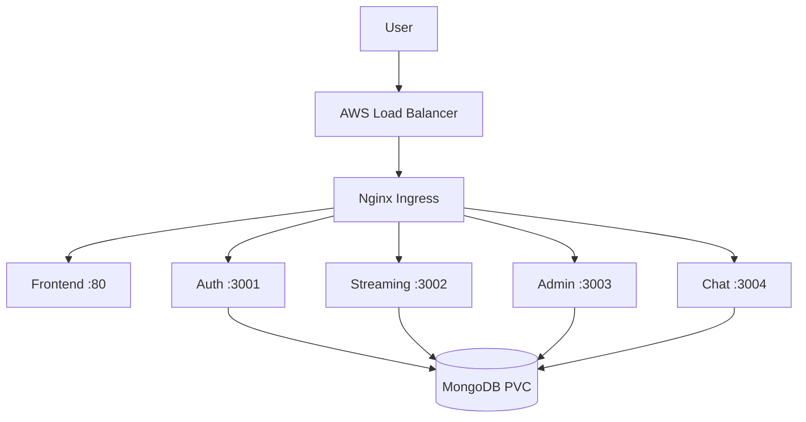
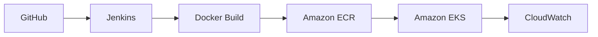

# StreamingApp - Container Orchestration and Scaling

## Project Summary

This project packages a five-service MERN streaming platform into Docker images, publishes the images to Amazon ECR through Jenkins CI, and deploys the system to Amazon EKS using Helm. The implementation includes persistent MongoDB storage, Nginx Ingress routing, safe rolling updates, horizontal scaling, centralized logs, Container Insights metrics, and a CloudWatch alarm.

Repository: https://github.com/Autobot1998/StreamingApp

## Architecture



CI flow:



## Components

| Component | Port | Container image | Kubernetes resource |
|---|---:|---|---|
| Frontend | 80 | streaming-frontend | Deployment + ClusterIP Service |
| Authentication | 3001 | streaming-auth | Deployment + ClusterIP Service |
| Streaming catalogue | 3002 | streaming-stream | Deployment + ClusterIP Service |
| Administration | 3003 | streaming-admin | Deployment + ClusterIP Service |
| Live chat | 3004 | streaming-chat | Deployment + ClusterIP Service |
| MongoDB | 27017 | mongo:6 | StatefulSet + headless Service + PVC |

## Prerequisites

- Docker Engine/Desktop
- Git
- AWS CLI authenticated to `ap-south-1`
- kubectl
- Helm
- eksctl
- AWS permissions for ECR, EKS, EC2, IAM, CloudFormation, EBS and CloudWatch

## Containerization and ECR

Five Docker images were built. The auth image installs temporary Alpine build tools because the native `bcrypt` dependency may need source compilation. Build dependencies are removed after `npm install --omit=dev` to limit the final image size.

Example builds:

```bash
docker build -t streaming-auth:1.0.0 ./backend/authService
docker build -t streaming-stream:1.0.0 -f backend/streamingService/Dockerfile backend
docker build -t streaming-admin:1.0.0 -f backend/adminService/Dockerfile backend
docker build -t streaming-chat:1.0.0 -f backend/chatService/Dockerfile backend
docker build -t streaming-frontend:1.0.0 ./frontend
```

Dedicated ECR repositories were created with scan-on-push enabled. Images are tagged with semantic versions and Jenkins build versions before push.

## Jenkins Continuous Integration

The root `Jenkinsfile` defines the following stages:

1. Checkout from the `main` branch.
2. Authenticate to ECR using a restricted Jenkins credential.
3. Build all five images using their correct build contexts.
4. Tag images as `1.0.<BUILD_NUMBER>`.
5. Push all images to their matching ECR repositories.
6. Log out from ECR in the post action.

The Jenkins IAM identity is restricted to ECR authentication and push/pull operations on repositories matching `streaming-*`. Administrator credentials are not stored in Jenkins. Poll SCM checks the repository every five minutes and starts a pipeline when a commit changes.

Validated CI result: all five stages succeeded and five images were pushed with tag `1.0.5`.

## EKS Environment

Cluster configuration:

| Setting | Value |
|---|---|
| Cluster | streamingapp-cluster |
| Region | ap-south-1 |
| Kubernetes | 1.34 |
| Managed node group | streamingapp-free-nodes |
| Instance type | c7i-flex.large |
| Desired nodes | 2 |

The x86_64 node type matches the locally produced amd64 container images. The EBS CSI driver provides dynamic persistent-volume provisioning for MongoDB.

## Helm Deployment

The chart is stored at `helm/streamingapp` and includes:

- Five configurable Deployments and Services
- ConfigMap for non-secret runtime configuration
- Secret template for sensitive configuration
- MongoDB StatefulSet and 5 GiB gp2 PVC
- Readiness and liveness probes
- CPU/memory requests and limits
- Nginx Ingress
- Per-service image tags and replica counts
- RollingUpdate with `maxUnavailable: 0` and `maxSurge: 1`

Validation and installation:

```bash
helm lint helm/streamingapp
helm template streamingapp helm/streamingapp > rendered.yaml
helm upgrade --install streamingapp helm/streamingapp \
  --namespace streamingapp --create-namespace --wait --timeout 10m
```

## Traffic Routing

| Ingress path | Backend |
|---|---|
| `/` | frontend-svc:80 |
| `/api/auth` | auth-svc:3001 |
| `/api/streaming` | streaming-svc:3002 |
| `/api/admin` | admin-svc:3003 |
| `/api/chat` | chat-svc:3004 |

The Nginx Ingress Controller is exposed through an AWS LoadBalancer Service. Separate Ingress resources preserve the Streaming API path while rewriting Auth, Admin and Chat prefixes to their internal /api routes. External health, streaming and authenticated verification requests returned HTTP 200.

## Scaling and Rolling Updates

The streaming deployment was scaled from two to four replicas:

```bash
kubectl scale deployment streaming --replicas=4 -n streamingapp
kubectl rollout status deployment/streaming -n streamingapp
```

Auth was upgraded to image tag `1.0.1` through Helm while streaming remained at four replicas:

```bash
helm upgrade streamingapp helm/streamingapp -n streamingapp \
  --set services.auth.tag=1.0.1 \
  --set services.streaming.replicas=4 --wait --timeout 10m
kubectl rollout status deployment/auth -n streamingapp
```

The auth rollout succeeded. `maxUnavailable: 0` and `maxSurge: 1` keep the old replicas available while a new replica becomes ready.

## Monitoring and Centralized Logging

The Amazon CloudWatch Observability EKS add-on is active. CloudWatch Agent collects Container Insights metrics and Fluent Bit forwards container logs from both nodes. All five EKS control-plane log types are enabled: API server, audit, authenticator, controller manager and scheduler.

A CloudWatch alarm named `StreamingApp-High-Node-CPU` monitors the Container Insights `node_cpu_utilization` metric with an 80 percent threshold over one five-minute evaluation period.

## Validation Checklist

- [x] Five local Docker images built
- [x] Five ECR repositories created
- [x] Images pushed manually and through Jenkins
- [x] Jenkins build and push pipeline succeeded
- [x] EKS managed nodes are Ready
- [x] Helm lint passed
- [x] Helm release status is deployed
- [x] Five application Deployments are available
- [x] MongoDB StatefulSet is Ready
- [x] MongoDB PVC is Bound
- [x] Ingress has an AWS Load Balancer hostname
- [x] Frontend returned HTTP 200
- [x] Streaming scaled to four replicas
- [x] Auth rolling update succeeded
- [x] CloudWatch Agent and Fluent Bit are Running
- [x] CloudWatch CPU alarm created
- [x] Auth registration returned HTTP 201
- [x] Login and JWT cookie generation succeeded
- [x] Protected authentication endpoint returned HTTP 200
- [x] Admin, Chat and Streaming APIs returned HTTP 200 through Ingress
- [x] End-to-end smoke test passed

## Troubleshooting Notes

1. `bcrypt` failed to install in Alpine when its prebuilt binary was unavailable. Temporary Python, make and g++ packages enabled source compilation.
2. The first node group used `t3.medium`, which this free-plan account rejected. A free-tier-eligible x86_64 `c7i-flex.large` node group resolved the launch failure.
3. An empty `aws_session_token` entry caused EKS kubectl authentication failures. Removing the empty entry restored token authentication for the long-term IAM key.
4. MongoDB remained Pending because the PVC initially had no storage class and the EBS CSI provisioner was absent. Setting `storageClassName: gp2` and installing the EBS CSI add-on bound the 5 GiB volume.

## Security and Cleanup

- Never commit AWS credentials, kubeconfig files or rendered Secrets.
- Delete the temporary Jenkins ECR access key after submission.
- Remove broad temporary IAM permissions after validation.
- Delete the EKS cluster, Load Balancer, EBS volume and unused ECR images when the project is no longer required.

Cluster teardown:

```bash
eksctl delete cluster --name streamingapp-cluster --region ap-south-1
```

